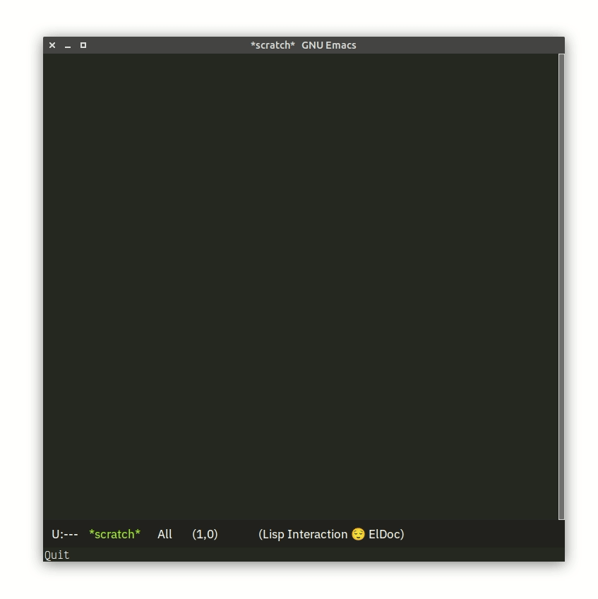

= svg.el

image:https://github.com/hupf/svgo.el/actions/workflows/tests.yml/badge.svg[Tests Status,link="https://github.com/hupf/svgo.el/actions/workflows/tests.yml"]
image:https://img.shields.io/badge/license-GPL_v3-green.svg[GNU GPL v3,link="./LICENSE"]

[quote]
SVG optimization within Emacs with SVGO

This package uses the Node utility https://github.com/svg/svgo[SVGO] to optimize SVG files. It provides a command and an optional minor mode to reduce the size of the SVG contents in the current Emacs buffer.

== Installation

To install this package you should use `use-package`, like so:

[source]
----
(use-package svgo
  :straight '(svgo :type git :host github :repo "hupf/svgo.el")
  :hook ((image-mode . svgo-mode)
         (nxml-mode . svgo-mode)))
----

Also make sure you have Node/NPM installed on your machine.

== Usage

After opening a SVG file in Emacs, you can toggle the image display with `C-c C-c`. Then either execute `M-x svgo` or with the `svgo-mode` minor mode configured you can press `C-c o` to optimize the file.

If the `svgo` NPM package is missing you will be prompted to automatically install it.

== Contribution

Install https://github.com/cask/cask[Cask], then run:

[source]
----
make
----

Run all tests with:

[source]
----
make test
----

== License

This program is free software; you can redistribute it and/or modify it under the terms of the GNU General Public License as published by
the Free Software Foundation; either version 3, or (at your option) any later version.

This program is distributed in the hope that it will be useful, but WITHOUT ANY WARRANTY; without even the implied warranty of
MERCHANTABILITY or FITNESS FOR A PARTICULAR PURPOSE. See the GNU General Public License for more details.

== Author

Mathis Hofer
